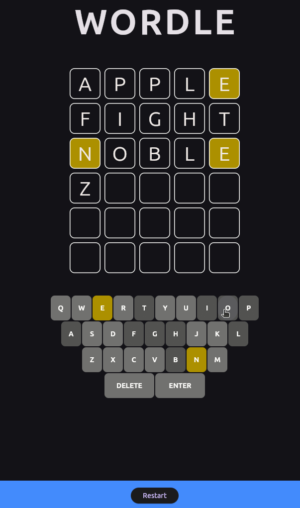

# Wordle Clone

A clone of the popular word-guessing game built with [Flutter](https://flutter.dev).
Project made to learn Flutter. Idea from this [repo](https://github.com/practical-tutorials/project-based-learning?tab=readme-ov-file).

## Table of Contents

- [How to Play](#how-to-play)
- [Running the App](#running-the-app)
  - [On Linux(Ubuntu)](#on-linux-ubuntu)
  - [On Windows](#on-windows)

## 🎮 How to Play

<div align="center">
  
  <br>
  <em>Gameplay demonstration</em>
</div>

**Guess the hidden 5-letter word in 6 tries**

- 🟩 Green letter: Correct letter in correct position
- 🟨 Yellow letter: Correct letter in wrong position
- ⬛ Gray letter: Letter not in word

## Running the App

Instructions on setting up and running the application on different platforms.

> [!TIP]
> If you meet any problems in the process run:
> ```bash 
> flutter doctor 
>```
> It checks your setup for missing dependencies and configuration issues.


### On Linux (Ubuntu)

Enable Linux Desktop Support:
```bash
flutter config --enable-linux-desktop
```

Build and Run the App:
```bash
flutter build linux
./build/linux/x64/release/bundle/wordle_clone
```


### On Windows

Enable Linux Desktop Support:
```bash
flutter config --enable-windows-desktop
```

Build and Run the App:
```bash
flutter build windows
.\build\windows\runner\Release\wordle_clone.exe
```

